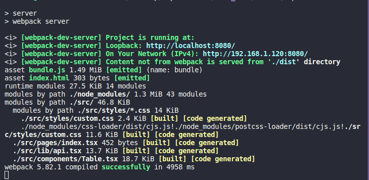
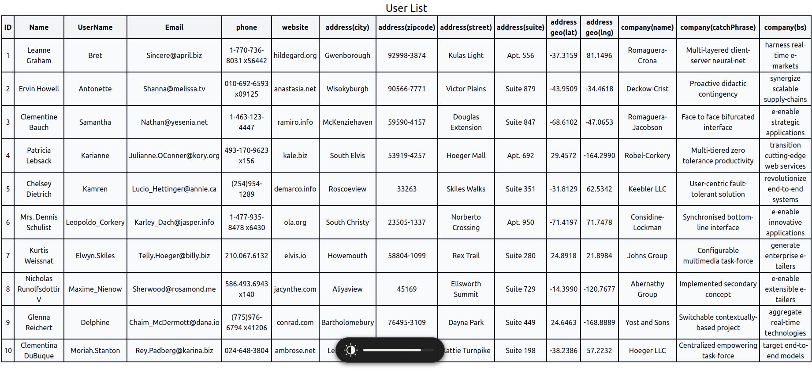

# User List project

User List it's a simulation of companies test for admission.

### Getting Started

Make sure you're using the latest **LTS node.js** version!

### Installing

Install all the dependencies:

```
    npm install
```
Let's get started by running webpack on terminal to generate your `/dist` folder:

```
    npm run build
```
This option above you generate your build on production mode by default, however you can also generate it on development mode runnig:

```
    npm run build:dev
```

After that, to see your page on browser you have to run:

```
    npm run server
```
You will have some options to access your local host(the choise is upon you)



Then, if you want to automatically save your changes you need to run:

```
    npm run watch
```

### You just successfully generated your page!



One more thing we should run in terminal, are the tests. Following the next steps to run Jest.

## Runnig test with Jest
We can run the tests with `npm run test` command line, it will run `jest --coverage` and generate a `/coverage` folder and it'll show this in your terminal:

Now, since we have our page builded and tests passed we just need to run Eslint in our code to maintain a pattern.
Run `npm run lint:fix` command line, it'll trigger eslint only on `src/.` , but this can be changed on `.eslintrc.js` configuration.
it will return all the code that have to be fixed if needed and fix the errors.

**But we also can run our tests with VScode's extendions like:** [Jest](https://marketplace.visualstudio.com/items?itemName=Orta.vscode-jest)

At this point our folder structure should look like this:

**User List**
```
|- .github  
  |- /workflows
|- client  
  |- /coverage
  |- /dist
    |- bundle.js
    |- index.html
  |- /node_modules
  |- /src
    |- /components
      |- _tests_
    |- /interfaces
    |- /lib
    |- /pages
    |- /public
    |- /styles
  |- .eslintgnore
  |- .eslintrc.js
  |- .gitignore
  |- .babel.config.js
  |- jest.config.js
  |- package-lock.json
  |- package.json
  |- postcss.config.js
  |- README.md
  |- tailwind.config.js
  |- tsconfig.json
  |- webpack.config.js

```